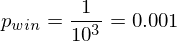
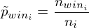
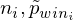
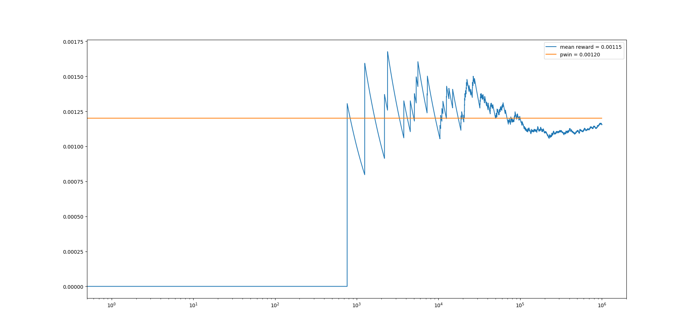
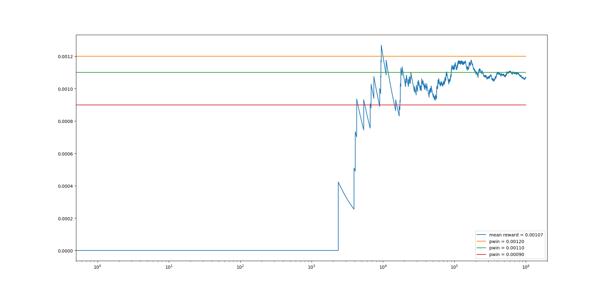
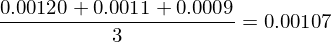
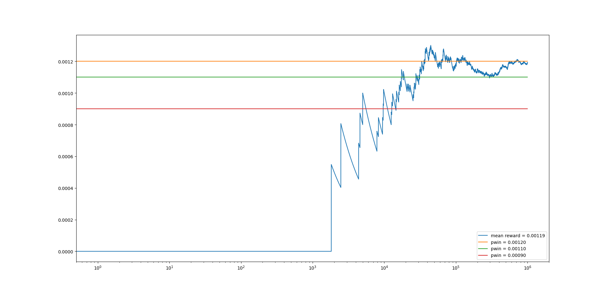

# Il bandito bracciuto
## Introduzione leggera ma non troppo all'apprendimento con rinforzo.

Siete stanchi di lavorare e volete passare una vita in vacanza?

Bene, andiamo al casinò, però non siamo degli sprovveduti, quindi dobbiamo scegliere con attenzione la nostra strategia: a cosa giochiamo?

Alla roulette?

Non sembra una buona idea, al tavolo c'è quel signore pelato e barbuto che sta vincendo tutto!

Giochiamo a poker?

Ehi... ma non sappiamo giocare a poker!

Giochiamo alle slot machine!

Siamo andati in un casinò retrò, quindi le slot machine sono quelle meccaniche a 3 rulli con 10 simboli ciascuno e con una leva, il braccio, in inglese _arm_, che bisogna tirare per far ruotare i rulli. Si vince quando su tutti rulli compare lo stesso simbolo. Che probabilità abbiamo di vincere?



Un po' bassa, non per nulla le chiamano _macchinette mangia soldi_ ed i nostri amici inglesi le chiamano _bandit_, _armed bandit_ per la precisione, letteralmente _bandito bracciuto_, facendo riferimento alla leva che le aziona.

Va bene, non disperiamoci, nel casinò c'è una fila di slot machine, sono ancora quelle meccaniche e la probabilità di vincere non è certamente quella teorica che abbiamo calcolato.

Come facciamo ad individuare la slot machine con la probabilità di vincere più alta e quindi a noi più favorevole?

Dobbiamo provare a giocare con tutte, registriamo per ogni slot machine:

- il numero di volte che abbiamo vinto;
- il numero di volte che abbiamo giocato;

il rapporto ci fornisce una stima della probabilità di vincere:



Facciamo una simulazione adoperando Python.

Tanto per cominciare dobbiamo modellare il bandito, la slot machine:

```python
import numpy as np

class Bandit:
    def __init__(self, reels: int, symbols: int):
        self.pwin: float = 1 / np.power(symbols, reels)

    def pull(self) -> float:
        return 1 if np.random.rand() < self.pwin else 0
```

Vediamo com'è fatta la classe ```Bandit```.

Il costruttore accetta come parametri di input:
- ```reels```: numero di rulli;
- ```symbols```: numero di simboli presenti su ciascun rullo;

e calcola la probabilità di vincere ```pwin```.

Il metodo ```pull()``` simula l'azione di giocare alla slot machine, per cui genera un numero casuale uniformemente distribuito fra 0 ed 1: se è minore della probabilità di vincere, abbiamo vinto ed il metodo restituisce 1, altrimenti restituisce 0.

Abbiamo detto però, che le slot machine sono meccaniche, per cui la probabilità di vincere non è quella teorica, ma non può allontanarsi molto da questa, per cui aggiungiamo al costruttore un'ulteriore parametro ```delta``` che indica questo scostamento:

```python
import numpy as np

class Bandit:
    def __init__(self, reels: int, symbols: int, delta: float):
        self.pwin: float = 1 / np.power(symbols, reels) + delta

    def pull(self) -> float:
        return 1 if np.random.rand() < self.pwin else 0
```

Adesso dobbiamo modellare il giocatore, che gioca alle slot machine e registra le vincite per stimare la probabilità di vincita:

```python
from base.Bandit import Bandit

class Player:
    def __init__(self, bandit: Bandit):
        self.bandit: Bandit = bandit
        self.k: int = 0
        self.q: float = 0

    def update(self, r: float):
        self.q += (r - self.q) / (self.k + 1)
        self.k += 1

    def play(self) -> float:
        r: float = self.bandit.pull()
        self.update(r)
        return r
```

La classe ```Player``` ha tre attributi:

- ```bandit```: la slot machine con cui giocare, ossia il puntatore all'istanza della classe ```Bandit``` che simula la slot machine;
- ```k```: numero di volte che il giocatore ha giocato;
- ```q```: probabilità stimata di vincere.

Gli ultimi due attributi corrispondono rispettivamente a:



La classe ha inoltre tre metodi:

- ```update(float)```: simula l'operazione di registrazione dei dati, ossia aggiorna il numero di volte ```k``` che il giocatore ha giocato e la probabilità stimata di vincere ```q```, in base all'esito ```r``` della giocata;
- ```play()```: simula l'azione di giocare alla slot machine, per cui richiama il metodo ```pull()``` dell'istanza di ```Bandit```, e di registrazione dei dati tramite il metodo ```update(float)```.  

Facciamo un esperimento con le due classi:

```python
from typing import List
from base.Bandit import Bandit
from base.Player import Player
import numpy as np
import matplotlib.pyplot as plt

class Experiment:
    @staticmethod
    def main():
        reels: int = 3
        symbols: int = 10
        delta: float = 0.0002
        n: int = 1000000

        bandit: Bandit = Bandit(reels, symbols, delta)
        player: Player = Player(bandit)

        r: List[float] = [0] * n
        for i in range(n):
            r[i] = player.play()

        rewards_trend: List[float] = np.cumsum(r) / np.arange(1, n + 1)
        plt.plot(rewards_trend, label='mean reward = {0:.5f}'.format(rewards_trend[-1]))

        plt.plot([0, n - 1], [bandit.pwin, bandit.pwin], label='pwin = {0:.5f}'.format(bandit.pwin))
        print('q = {0:.5f}  pwin = {1:.5f}'.format(player.q, bandit.pwin))

        plt.xscale('log')
        plt.legend()
        plt.show()

if __name__ == "__main__":
    Experiment.main()
```

La classe ```Experiment``` ha il metodo statico ```main``` che crea l'oggetto rappresentate la slot machine, quello rappresentante il giocatore, quindi esegue 1000000 di interazioni e per concludere visualizza l'andamento della probabilità stimata di vincere:



```
q = 0.00115  pwin = 0.00120
```

Ok, funziona ma non dimentichiamo che l'obiettivo è modellare il giocatore in modo che possa individuare  la slot machine con la probabilità di vincere più favorevole, per cui modifichiamo la classe ```Player```: 

```python
from typing import List
from base.Bandit import Bandit
import numpy as np

class Player:
    def __init__(self, bandits: List[Bandit]):
        self.bandits: List[Bandit] = bandits
        self.n: int = len(bandits)
        self.k: List[int] = [0] * self.n
        self.q: List[float] = [0] * self.n

    def choose(self) -> int:
        return np.random.choice(self.n)

    def update(self, a: int, r: float):
        self.q[a] += (r - self.q[a]) / (self.k[a] + 1)
        self.k[a] += 1

    def play(self) -> float:
        a: int = self.choose()
        r: float = self.bandits[a].pull()
        self.update(a, r)
        return r
```

L'attributo ```bandit``` ha lasciato il posto a ```bandits``` che contiene la lista delle slot machine cui giocare, mentre gli attributi ```k``` e ```q``` sono diventati anch'essi delle liste contenenti per ogni slot machine il numero di volte che il giocatore ha giocato e la probabilità stimata di vincere. Si è aggiunto l'attributo ```n``` che contiene il numero di slot machine.

E' stato aggiunto il metodo ```choose()``` che, in maniera casuale con una distribuzione uniforme, sceglie la slot machine cui giocare.

Il metodo ```update(int, float)``` è stato modificato in modo da accettare come parametro di input l'indicazione della slot machine cui giocare, mentre il metodo ```play()``` in più invoca ```choose()```, in modo da scegliere la slot machine su cui giocare.

Facciamo un altro esperimento con tre slot machine e verifichiamo che la classe ```Player``` riesca ad individuare quella con la probabilità di vincere più favorevole:

```python
from typing import List
from base.Bandit import Bandit
from randompolicy.Player import Player
import numpy as np
import matplotlib.pyplot as plt

class Experiment:
    @staticmethod
    def main():
        reels: int = 3
        symbols: int = 10
        deltas: List[float] = [0.0002, 0.0001, -0.0001]
        n: int = 1000000

        bandits: List[Bandit] = [Bandit(reels, symbols, delta) for delta in deltas]
        player: Player = Player(bandits)

        r: List[float] = [0] * n
        for i in range(n):
            r[i] = player.play()

        rewards_trend: List[float] = np.cumsum(r) / np.arange(1, n + 1)
        plt.plot(rewards_trend, label='mean reward = {0:.5f}'.format(rewards_trend[-1]))

        for i in range(len(bandits)):
            plt.plot([0, n - 1], [bandits[i].pwin, bandits[i].pwin], label='pwin = {0:.5f}'.format(bandits[i].pwin))
            print('Bandit #{0} : q = {1:.5f}  pwin = {2:.5f}'.format(i, player.q[i], bandits[i].pwin))

        plt.xscale('log')
        plt.legend()
        plt.show()

if __name__ == "__main__":
    Experiment.main()
```



```
Bandit #0 : q = 0.00118  pwin = 0.00120
Bandit #1 : q = 0.00106  pwin = 0.00110
Bandit #2 : q = 0.00096  pwin = 0.00090
```
Cosa possiamo osservare?

1. La probabilità media stimata di vincere è 0.00107, esattamente uguale a quella teorica ossia, considerando che le giocate sono uniformemente distribuite fra le 3 slot machine è:



2. Siamo riusciti ad individuare la slot machine con la probabilità di vincere a noi più favorevole, ossia è quella che ha il valore di ```q``` più alto, cioè la prima.

3. Non abbiamo sfruttato quest'ultima informazione, in quanto abbiamo adoperato tutte le giocate e quindi tutte i gettoni a nostra disposizione, solo per individuare la slot machine migliore con la quale giocare, ma poi non ci abbiamo giocato.

Miglioriamo il nostro ```Player``` e facciamo in modo che una parte delle giocate sia adoperata per individuare la slot machine migliore con cui giocare e la parte restante per giocare alla migliore:

```python
from typing import List
from base.Bandit import Bandit
import numpy as np

class Player:
    def __init__(self, epsilon: float, bandits: List[Bandit]):
        self.epsilon: float = epsilon
        self.bandits: List[Bandit] = bandits
        self.n: int = len(bandits)
        self.k: List[int] = [0] * self.n
        self.q: List[float] = [0] * self.n

    def choose(self) -> int:
        a: int = 0
        p: float = np.random.random()
        if p < self.epsilon:
            a = np.random.choice(self.n)
        else:
            a = np.argmax(self.q)
        return a

    def update(self, a: int, r: float):
        self.q[a] += (r - self.q[a]) / (self.k[a] + 1)
        self.k[a] += 1

    def play(self) -> float:
        a: int = self.choose()
        r: float = self.bandits[a].pull()
        self.update(a, r)
        return r
```

Vediamo cos'è cambiato:

- è stato aggiunto l'attributo ```epsilon``` che indica la percentuale delle giocate da adoperare per la ricerca della slot machine migliore; se ```epsilon = 0.05``` significa che il 5% delle giocate verrà adoperato a questo scopo;
- il metodo ```choose()``` genera un numero casuale uniformemente distribuito fa 0 ed 1, se questo è inferiore a ```epsilon``` la slot machine viene scelta a caso come prima, altrimenti si sceglie quella che fino a quel momento ha la probabilità stimata di vincere più alta.

Facciamo un esperimento:

```python
from typing import List
from base.Bandit import Bandit
from epsilongreedy.Player import Player
import numpy as np
import matplotlib.pyplot as plt

class Experiment:
    @staticmethod
    def main():
        reels: int = 3
        symbols: int = 10
        deltas: List[float] = [0.0002, 0.0001, -0.0001]
        epsilon: float = 0.05
        n: int = 1000000

        bandits: List[Bandit] = [Bandit(reels, symbols, delta) for delta in deltas]
        player: Player = Player(epsilon, bandits)

        r: List[int] = [0] * n
        for i in range(n):
            r[i] = player.play()

        rewards_trend: List[float] = np.cumsum(r) / np.arange(1, n + 1)
        plt.plot(rewards_trend, label='mean reward = {0:.5f}'.format(rewards_trend[-1]))

        for i in range(len(bandits)):
            plt.plot([0, n - 1], [bandits[i].pwin, bandits[i].pwin], label='pwin = {0:.5f}'.format(bandits[i].pwin))
            print('Bandit #{0} : q = {1:.5f}  pwin = {2:.5f}'.format(i, player.q[i], bandits[i].pwin))

        plt.xscale('log')
        plt.legend()
        plt.show()

if __name__ == "__main__":
    Experiment.main()
```


```
Bandit #0 : q = 0.00120  pwin = 0.00120
Bandit #1 : q = 0.00101  pwin = 0.00110
Bandit #2 : q = 0.00110  pwin = 0.00090
```

La cosa che balza all'occhio è che adesso la probabilità che abbiamo di vincere è salita a 0.00119 e, considerando che la massima teorica è 0.0012, possiamo ritenerci più che soddisfatti.

## Cosa abbiamo imparato?

Rivediamo tutto ciò che abbiamo fatto finora in un'altra ottica.

| Concetto           | Spiegazione                                                  |
| ------------------ | ------------------------------------------------------------ |
| **_reward_**       | La vincita alle slot machine è la **ricompensa**.            |
| **_action_**       | Il giocare ad una slot machine è l'**azione**.               |
| **_goal_**         | La massimizzazione delle vincite è l'**obiettivo**.          |
| **_policy_**       | La strategia per raggiungere l'obiettivo è la **politica**.  |
| **_action-value_** | Il valore della probabilità di vincere giocando alla slot machine _i_-esima è il **valore dell'azione** di giocare a quella slot machine. |
| **_agent_**        | Il giocatore è l'**agente**.                                 |
| **_environment_**  | Le slot machine sono l'**ambiente**.                         |

Con questa mappa in mente, possiamo riformulare il comportamento del sistema che abbiamo modellato.

| Comportamento modellato                                      | Riformulazione                                               |
| ------------------------------------------------------------ | ------------------------------------------------------------ |
| Il giocatore gioca ad una delle slot machine.                | L'agente compie un'azione nell'ambiente.                     |
| Dalle slot machine riceve il jackpot se vince, nulla in casso contrario. | Dall'ambiente riceve una ricompensa.                         |
| Il giocatore deve stimare la probabilità di vincere per ogni slot machine. | L'agente deve stimare il valore delle azioni.                |
| Stimata la probabilità di vincere per ogni slot machine, il giocatore ha un criterio per scegliere la slot machine cui giocare in modo da massimizzare le vincite. | Stimato il valore delle azioni, l'agente ha una politica di scelta delle azioni che gli permetta di raggiungere il suo obiettivo, ossia massimizzare la ricompensa nel lungo periodo. |

Quello descritto nella colonna di destra è esattamente il contesto nel quale si cala quella branca dell'apprendimento automatico che si chiama **_apprendimento con rinforzo_**, **_reinforcemente learning_** in inglese.

Nella formulazione più generale, in realtà l'ambiente ha uno **stato** che evolve in seguito alle azioni compiute dall'agente; qui non è stato descritto perché l'ambiente adoperato come esempio, l'insieme delle slot machine, è senza stato.

Il problema che bisogna risolvere è quello di stimare la funzione **action-value**. La cosa più importante di tutte però ed anche la più affascinante, è che l'**agente** cerca di stimare questa funzione **_adoperando l'interazione con l'ambiente e l'esperienza_**. Questo approccio è fondamentalmente diverso dalle altre due principali branche dell'apprendimento automatico che sono l'apprendimento supervisionato e quello non-supervisionato.

## Esplorazione contro sfruttamento

Ma perché nella scelta dell'azione il nostro modello sceglieva in parte un'azione casuale ed in parte quella che aveva il valore-azione più alto?

Un problema che si pone nell'apprendimento con rinforzo è quello di **bilanciare** l'**esplorazione** delle possibili azioni, per stimare il loro valore e lo **sfruttamento** di quelle che fino a quel momento sembrano le migliori. In questo modo si evita di sfruttare quelle azioni che sembrano quelle ottimali ma non lo sono perché non sono state esplorate anche le altre e quindi _non si ha esperienza sufficiente_. Questo problema è noto come **_exploration-exploitation dilemma_**.

L'approccio seguito negli esempi mostrati si chiama **_eps-Greedy_**: **_eps_** rappresenta quella percentuale delle azioni che vengono scelte casualmente; **_greedy_** invece, letteralmente **_goloso_**, indica la scelta dell'azione che sembra ottimale.

## Conslusioni

Questo articolo non ha la pretesa di spiegare in maniera rigorosa e dettagliata l'apprendimento con rinforzo, ha piuttosto l'obiettivo di stimolare la vostra curiosità e far sapere che esiste anche questa branca dell'apprendimento automatico, che non è meno importante delle altre due più note: basti pensare che queste tecniche sono adoperate per la guida autonoma.

Spero vi sia piaciuto e sarei felice di ricevere i vostri suggerimenti per migliorarlo.